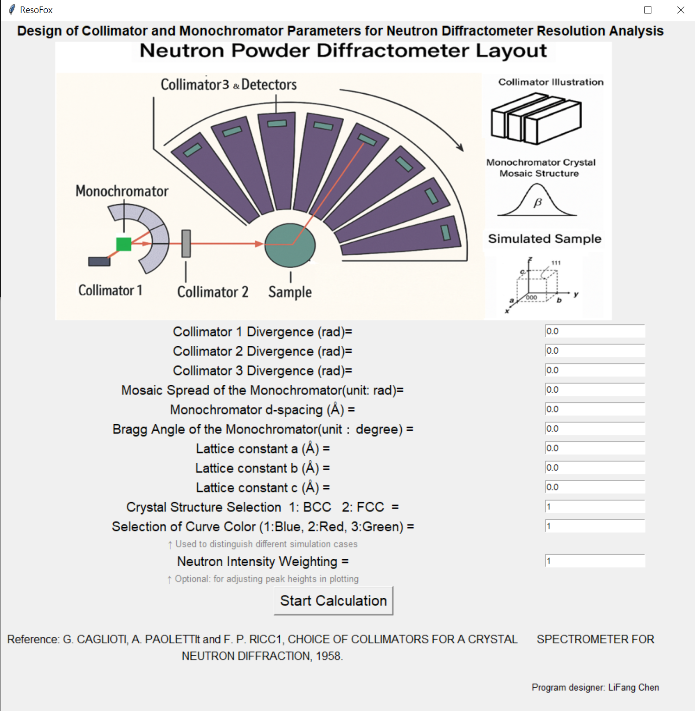
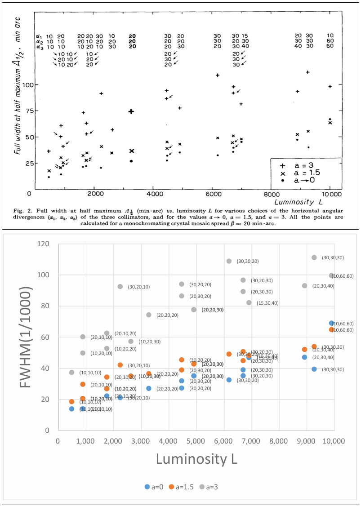
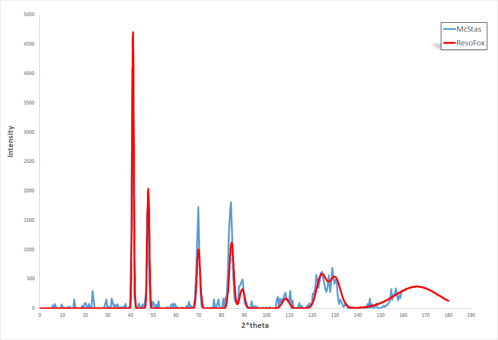
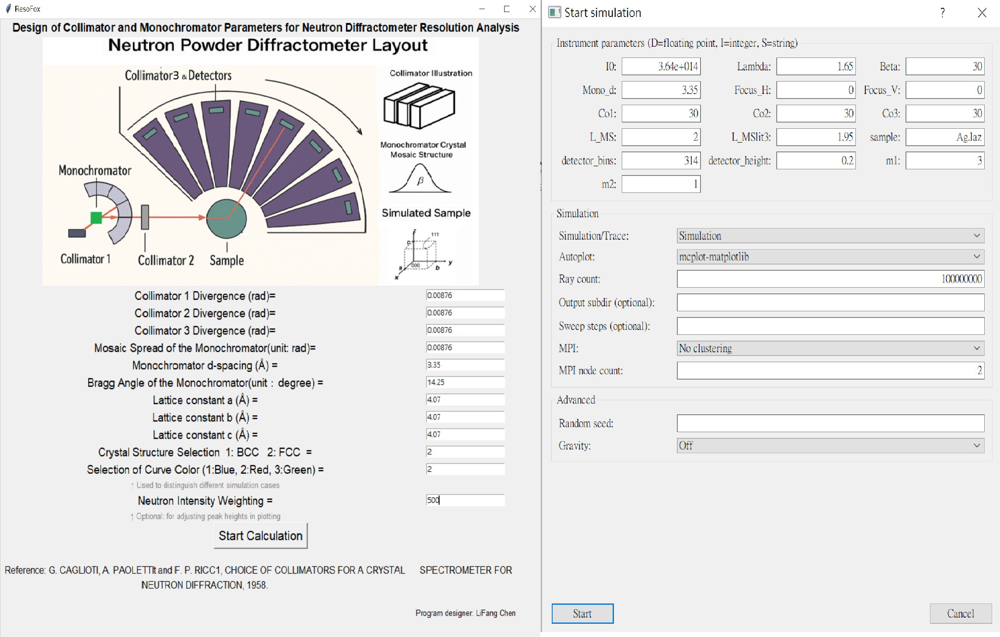

# ResoFox
A GUI-based tool for calculating resolution and flux of neutron powder diffractometers.
## 摘要

ResoFox 是一款以 Python 開發、具備圖形介面之中子繞射儀理論分析工具，專為探討光學元件（準直儀與單能儀）對繞射圖譜解析度與相對強度影響而設計。本程式根據 Caglioti 等人於 1958 年所提出的解析度理論，並搭配 Bragg 定律與基本繞射公式，提供用戶於不同幾何與光學參數下進行模擬計算。

本工具特別整合視覺化繪圖介面，能夠在輸入儀器參數後即時呈現：
- 相對中子光強度（luminosity）
- 繞射峰半高寬（FWHM）與角度解析度
- 樣品的理論繞射圖（支援 FCC 與 BCC 晶格）

本工具已於 2024 台灣中子年會進行展示，並與 Monte Carlo 模擬工具 McStas 進行對照驗證。

---

## 研究動機與背景

中子繞射是研究材料結構與磁性的重要手段，解析度與通量為繞射儀設計之關鍵指標。儘管 McStas 等模擬工具可提供詳盡之粒子追蹤結果，但對於儀器設計初期而言，快速獲得理論解析度與光強度估算更具實用價值。

Caglioti 於 1958 年發表經典公式，以 collimator divergence（α₁, α₂, α₃）與單晶 mosaic spread（β）計算繞射半高寬，迄今仍廣泛應用於中子光學設計。本專案即基於該模型，開發易用之程式工具，並結合視覺化操作介面，有助於設計者於參數調整下迅速獲得定量結果。

---

## 程式設計與功能說明

ResoFox 採用 Python 開發，並以 `tkinter` 建構圖形介面。使用者可輸入以下參數進行模擬：

- 三組 collimator 發散角 α₁, α₂, α₃（以 rad 表示）
- 單晶 mosaic spread β（以 rad 表示）
- 單晶 d-spacing 及 Bragg angle（以 Å 與 ° 表示）
- 樣品晶格常數（a, b, c）與晶格類型（BCC = 1、FCC = 2）
- 中子波長與圖線顏色選擇

輸出結果包含：
- 相對光強度 Luminosity（不含反射率校正）
- FWHM 最小值與解析度曲線
- 晶格繞射圖（2θ-Intensity）可儲存為圖片
- Console 中輸出完整表格（含每個 peak 對應之 d 值、a 值、半高寬、解析度等）

📷 圖形介面示意：

---

## 與經典理論比對：1958 年文獻

ResoFox 模擬結果已與 G. Caglioti 等人於 1958 年論文所示之曲線進行比對，三組代表性參數組合（a = 0、1.5、3）下之 FWHM 與 Luminosity 關係圖如下：

結果顯示程式之解析度與光強度變化趨勢與原始理論高度吻合，顯示實作正確性。

---

## 與 McStas 模擬結果比對

為驗證 ResoFox 理論計算與 Monte Carlo 模擬結果一致性，使用 McStas 進行銀粉末繞射模擬（Ag powder, Ge(115), λ = 1.54 Å），所得繞射圖如下：

上圖為 ResoFox 預測之理論繞射圖，下圖為 McStas 模擬所得。兩者繞射峰位置高度一致，顯示 ResoFox 可作為有效驗證工具。

---

## 輸入參數操作範例（ResoFox vs McStas）

下圖展示 ResoFox 與 McStas 的對應輸入介面：

左側為 ResoFox，右側為 McStas GUI 輸入設定。完整參數亦已納入 case_study 資料夾中供下載使用。

---

## 案例與附檔：銀粉末比對分析

完整模擬與比對資料皆收錄於下列資料夾中：
'''
case_study_ag_powder/
├── arxiv_paper_2504.20341.pdf
└── mcstas_input.instr
'''
使用者可下載並重現分析流程。

---

## 開發環境與使用方式

- 開發環境：Python 3.8+
- 相依套件：tkinter、matplotlib、pandas、PIL
- 可使用 `ResoFox.exe` 直接執行（免安裝 Python）
- 程式可儲存繪圖與控制台表格資料

---

## 授權與引用

本工具採用 MIT 開源授權，可自由使用與修改，唯需註明來源。

引用範例：
'''
Li-Fang Chen, ResoFox: A GUI Tool for Neutron Diffractometer Resolution and Intensity Estimation, arXiv:2504.20341
'''
---

📩 如需技術支援或合作，請來信：`lifangchen0507@gmail.com`
