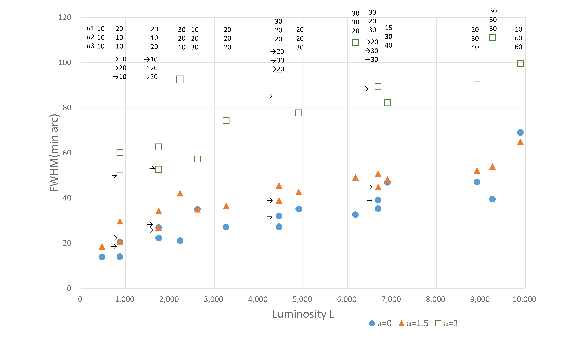
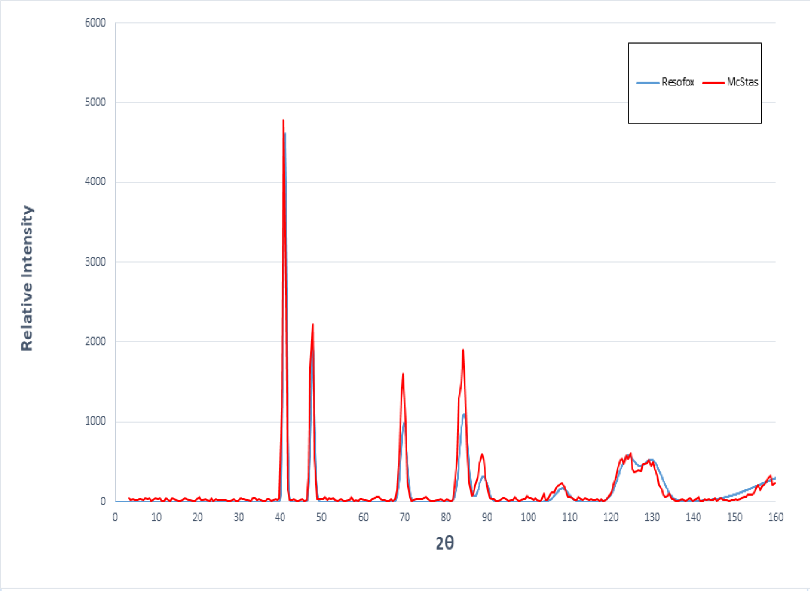

<p align="center">
  
</p>
<p align="center"><em>Illustration: ResoFox mascot explaining neutron diffraction and Bragg's Law.</em></p>

<h2 align="center">ResoFox</h2>
<p align="center"><em>A GUI-based tool for calculating resolution and flux of neutron powder diffractometers.</em></p>

---


## Abstract

<p align="center">
  
</p>


ResoFox is a Python-based graphical tool designed for theoretical analysis of neutron powder diffractometers. It focuses on evaluating the influence of optical components—namely collimators and monochromators—on diffraction peak resolution and relative intensity. The software is built upon the resolution model proposed by Caglioti et al. in 1958, combined with Bragg’s law and fundamental diffraction equations. It allows users to perform simulations under various geometric and optical configurations.

The tool features an integrated graphical interface and real-time plotting, capable of displaying:

Relative neutron beam intensity (luminosity)

Diffraction peak full width at half maximum (FWHM) and angular resolution

Theoretical powder diffraction patterns (supporting FCC and BCC lattices)

Beyond its computational capability, ResoFox also serves as a communication aid between sample users and instrument scientists. By providing visualized resolution versus angle plots and intensity trends, the tool enables non-specialist users to quickly estimate whether a given beamline configuration suits their experimental needs. This facilitates clearer technical discussions, speeds up experiment planning, and improves beamtime efficiency.

ResoFox was presented at the 2024 Taiwan Neutron Conference and has been benchmarked against Monte Carlo simulation results using McStas.


---

## Motivation and Background

Neutron diffraction is a vital technique for studying crystal structures and magnetism. Resolution and flux are two critical parameters in the design of neutron diffractometers. While Monte Carlo tools such as McStas offer detailed particle-level simulations, theoretical estimates of resolution and flux are more practical during the early stages of instrument design.

In 1958, Caglioti et al. proposed a widely adopted analytical model for calculating peak broadening using collimator divergences (α₁, α₂, α₃) and monochromator mosaic spread (β). Based on this model, ResoFox was developed to provide a user-friendly and visualized environment that enables designers to rapidly evaluate performance under varying design parameters.

---
## 📁 Repository Structure Overview
The following structure outlines the key components of the repository, including source code, simulation examples, and image assets used in the documentation:
```
ResoFox/
├── Examples/                                       # Simulation examples and McStas comparison data
│   ├── McStas_input_HOPG_Ag.instr                  # McStas instrument definition file
│   ├── Preliminary_Design_and_Performance_...pdf   # Simulation design and performance report
│   ├── McStas_input_HOPG_Ag_20250505_result/       # Output plots and data from McStas simulation
│   └── McStas_input_HOPG_Ag_20250505_instrument_.../  # Instrument geometry visualization (3D)
├── docs/                                           # Images used in README (e.g., diagrams, output plots)
├── LICENSE                                         # Software license (MIT License)
├── README.md                                       # Project description, usage, and citation info
├── ResoFox_v1.0.0.py                                   # Main program (GUI interface and core calculations)
├── ResoFox_v1.0.1.py                                   # Main program (Change Y-axis label to "Relative Intensity")
├── ResoFox_v1.0.2.py                                   # Main program (Update diffraction plot line styles and colors)
├── main_png.py                                     # Script for generating figures and geometry plots
```
## 🔧 Requirements
This software requires Python 3.7+ and the following packages:

```
pip install matplotlib pillow pandas
```
tkinter is included by default in most Python distributions (Windows/macOS).
For Linux users, if the GUI does not launch, install tkinter with:

```
sudo apt-get install python3-tk
```

## 📦 Module Functions

| Package                        | Purpose                                                                 |
|-------------------------------|-------------------------------------------------------------------------|
| `tkinter`                     | Build the graphical user interface (GUI) for input/output interaction  |
| `pillow`                      | Load and render image files in the GUI (e.g., logos, figures)          |
| `matplotlib`                  | Generate resolution/intensity plots and output figures                 |
| `pandas`                      | Handle tabular data (e.g., export diffraction results to CSV)          |
| `math`, `csv`, `io`, `base64` | Built-in Python libraries for computation, file handling, and encoding |
| `main_png` (from `main_png.py`) | Generate the explanatory image used in the GUI input panel layout     |


## Software Architecture and Functional Overview

ResoFox is developed in Python with a graphical user interface built using `tkinter`. Users can input the following parameters for simulation:

- Three collimator divergence angles: α₁, α₂, α₃ (in radians)
- Monochromator mosaic spread β (in radians)
- Monochromator d-spacing and Bragg angle (in Å and degrees)
- Sample lattice constants a, b, c and lattice type (BCC = 1, FCC = 2)
- Neutron wavelength and plot color selection


### Output features include:
- Relative beam luminosity (not corrected for reflectivity)
- Minimum FWHM and resolution curve
- Theoretical powder diffraction pattern (2θ vs intensity), exportable as an image
- Full data tables displayed in the console, including each peak’s:
  - d-spacing, calculated lattice constant a,
  - FWHM, angular resolution, and lattice resolution (Δd/d)

📷 GUI Interface Example:


---
## 📤 Output and Data Export

ResoFox supports real-time export of plotted figures and data tables, including:

- Click the **"Save Image"** button in the GUI to export charts in `.png` format (e.g., 2θ vs intensity plots).  
  Click **"Export Data"** to export numerical results related to the diffraction peaks.


If the **"Clear Plot"** button is not clicked, users can re-enter new parameters and select a different color in the input panel to overlay diffraction patterns from different simulation conditions.


---

## 📋 Console Output: Peak Angular Resolution Information

For each diffraction peak, the program automatically outputs the following resolution-related parameters:

- Full Width at Half Maximum (FWHM)
- Angular resolution
- Lattice resolution (Δd/d)
- Standard deviation (if applicable)

These values can be further compared against Monte Carlo simulation results (e.g., McStas) or experimental data.


---


## Validation Against Classical Theory: Caglioti et al. (1958)

To validate the correctness of ResoFox calculations, we reproduced the analytical resolution model proposed by G. Caglioti et al. (1958), which relates the full width at half maximum (FWHM) to beam luminosity (L) under different collimator angular divergences (α₁, α₂, α₃) and a fixed monochromator mosaic spread (β = 20 arcmin).

The plot is generated using ResoFox under the same conditions. Each dot represents a different collimator configuration, color-coded by  (a = 0, 1.5, 3).

The results demonstrate strong agreement with the classical model, successfully replicating the characteristic trend between luminosity and resolution. This confirms the analytical validity of ResoFox for preliminary instrument performance estimation.





⚠️ **Note:** The full width at half maximum (FWHM) values exported by ResoFox are in radians. They must be converted to arcminutes for proper comparison with the classic results presented by G. Caglioti *et al.*.  
Additionally, the relative intensity values calculated by ResoFox must be multiplied by a scaling factor in order to align with the intensity axis in the reference plots of G. Caglioti *et al.*. In this case, the scaling factor used is **4 × 10¹⁰**.

---
## Input Configuration Example (ResoFox vs. McStas)

The figure below shows a side-by-side comparison of the input interfaces used in ResoFox (left) and McStas (right). Both allow the definition of neutron diffractometer geometries and simulation parameters.


📌 Important note:
- In ResoFox, collimator divergence is entered in **radians**;
- In McStas, the divergence input is in **arcminutes**.

By matching the input parameters shown in the figure, users can replicate and compare the simulated diffraction patterns of silver powder (Ag.laz) using both tools.

McStas also provides sample materials; the example shown is a powder sample (`Ag.laZ`). To test different materials, users can simply change the sample name in the `sample` field of the McStas interface. The outputs from FCC and BCC lattice types can then be directly compared.


A full comparison of the angular resolution results between ResoFox’s theoretical model and McStas simulations has been published on arXiv. Input files and analysis outputs are included in the `examples/` directory.

🔍 Note: The figure shown here uses HOPG as the monochromator crystal, while the arXiv paper uses Ge(115). This difference is intentional to offer readers broader cross-validation and configuration flexibility.

---


## Comparison with McStas Simulation Results

To validate the consistency between ResoFox analytical calculations and Monte Carlo simulations, we conducted a benchmark test using McStas. The simulation models a HOPG(002) monochromator operating at a neutron wavelength of λ = 1.65 Å, targeting a silver (Ag) powder sample. The comparison is illustrated in the figure below:




Overall, the positions and trends of the diffraction peaks show strong agreement between the two tools, confirming that ResoFox provides reliable predictions of resolution and intensity based on geometric optics theory.

🔍 Possible reasons for the slight differences in peak heights:

Statistical noise in Monte Carlo simulation:
McStas employs Monte Carlo ray tracing, which can lead to fluctuations or sharp spikes in intensity near strong diffraction peaks when the number of simulated particles is insufficient. In contrast, ResoFox uses an analytical model, resulting in smoother and noise-free intensity profiles.

Normalization differences:
In this comparison, global normalization of total intensity was not applied. Instead, both datasets were aligned based on the main peak, which may cause minor discrepancies in the relative intensity of secondary peaks.


---

## Case Files and Example: Silver Powder Benchmark

All data used in the benchmark comparison are provided in the following folder:


```
Examples/                                       # Simulation examples and McStas comparison data
├── McStas_input_HOPG_Ag.instr                  # McStas instrument definition file
├── Preliminary_Design_and_Performance_...pdf   # Simulation design and performance report
├── McStas_input_HOPG_Ag_20250505_result/       # Output plots and data from McStas simulation
└── McStas_input_HOPG_Ag_20250505_instrument_.../  # Instrument geometry visualization (3D)
```

Users can download these files to reproduce the benchmark and validation results.

---

## Development Environment and Usage

- Development environment: Python 3.8+
- Dependencies: `tkinter`, `matplotlib`, `pandas`, `PIL`
- For non-Python users, a standalone executable `ResoFox.exe` is available (no Python installation required)
- The software allows exporting of generated plots and console output data tables

---

## ResoFox v1.0.0 Executable (Windows 64-bit)

This version provides a precompiled standalone executable for ResoFox. It can be used directly to perform resolution and diffraction pattern simulations for neutron powder diffractometers.

- 🔧 Development environment: Python 3.8
- 🛠️ Packaging tool: PyInstaller
- ✅ No Python installation required—just download and run


---

### Installation Instructions
1. Click the link below to download the `.exe` file.
2. Run `ResoFox_v1.0.0.exe`.
3. If a security warning appears (e.g., Windows SmartScreen), choose “Run anyway” or add the file to your whitelist.

---

### Source Code and Example Files:
Please refer to the [main README](../README.md) and the `case_study_ag_powder` folder for detailed instructions and examples.

---

## ResoFox v1.0.0 Executable (Windows 64-bit)

This is the standalone executable version of ResoFox, built with PyInstaller.

- Python version: 3.8  
- No installation required. Simply download and run.

For details on parameters and example inputs, please refer to the main README.

## 📥 Download Executable

[🔗 Click here to download ResoFox_v1.0.0.exe (Windows 64-bit)](https://github.com/lifangchen2021/ResoFox/releases/download/v1.0.0/ResoFox_v1.0.0.exe)
This is a packaged version of the software and does not require Python to be installed.  
If a security or antivirus warning appears, please select “Run anyway” or add the file to your trusted list.


⚠️ Note:
`ResoFox_v1.0.0.exe` is a Windows-only executable and currently supports **Windows 10 / 11 (64-bit)** systems.  
If you are using macOS or Linux, please run the source file `ResoFox_v1.py` with the required Python dependencies installed.

---

## License and Citation

This software is released under the **MIT License**, allowing free use and modification with appropriate attribution.

### Citation Example:

```
Li-Fang Chen, Preliminary Design and Performance Simulation of a Thermal Neutron Diffractometer Using McStas, arXiv:2504.20341
Li-Fang Chen, ResoFox: A GUI Tool for Neutron Diffractometer Resolution and Intensity Estimation
```
---

📩 For technical support or collaboration inquiries, please contact:  
`lifangchen0507@gmail.com`

